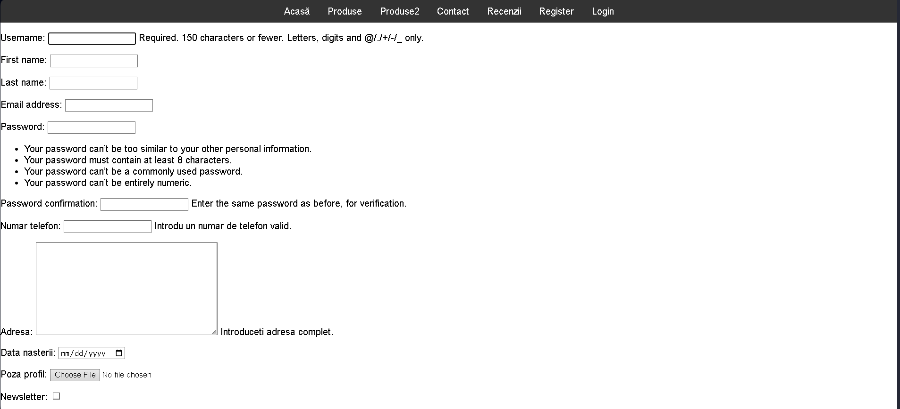

SneakerShop

SneakerShop is a web application for showcasing and selling sneakers, built with Django.

Features:
    Sneaker product catalog,
    User authentication system,
    Product management.

